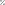

## Projeto

** 🧮Calculadora** 
Inicialmente estou desenvolvendo uma calculadora com as operações básicas **[+, -, \*, /]**.  
Algumas operações adicionais já foram incluídas nesta primeira versão, tais como **[funções trigonométricas báscias, oposto do número, radiciação, potenciação, fatorial, porcentagem, logaritimos]**.   
Há também a inclusão de constantes importantes **[PI, LN, Log(2), Log(10)]**

## Objetivo

**Aprendizado**
Estou trilhando um caminho de aprendizado e tenho feito projetos com o intuito de me desenvolver como dev.

## Funções Básicas 

**_Visor_** 
O visor da calculadora é dividido em 2 partes. Um visor principal que apresenta os números digitados pelo usuário e um visor superior que armazena o número digitado antes do botão de operação. Apresenta também o último botão de operação clicado.

**Limpar Visor** 
Ao clicar no botão 'AC' o visor da calculadora é limpo.

**_Vírgula_** 
Cria um número de ponto flutuante

**_Igualdade_** 
Executa a última operação clicada pelo usuário com os números salvos na memória. Há o número apresentado no display de operações e o apresentado no display de números.

**_Botões de Operação Básica_** 

 - somar 
 - subtrair 
 - divisão 
 - multiplicação 
 - porcentagem 
 - radiciação 
 - potenciação 
! - fatorial 
+/- Oposto de um número

**_Botões de Constantes_**

 - PI 
log2 - Logaritmo de base 2 
log10 - Logaritmo de base 10 
ln - Logaritmo de base neperiana 
e - Neper

**_Funções Trigonométricas_**

 - Seno 
 - Cosseno 
Tan - Tangente

## Tecnologias

Esta calculadora foi desenvolvida apenas com Html, css e javascript.

## Estrutura

Tentei estruturar o projeto com um arquivo javascript principal que importa todos os arquivos javascript utilizados no projeto.

Não criei o projeto pensando em reponsividade, assim sendo pode ser que ao usar em dispositivos de diferentes dimensões pode haver inconsistência no layout.

Criei estruturas de dados para obtenção das operações e contantes. Um arquivo somente para operações e outro para constantes.
